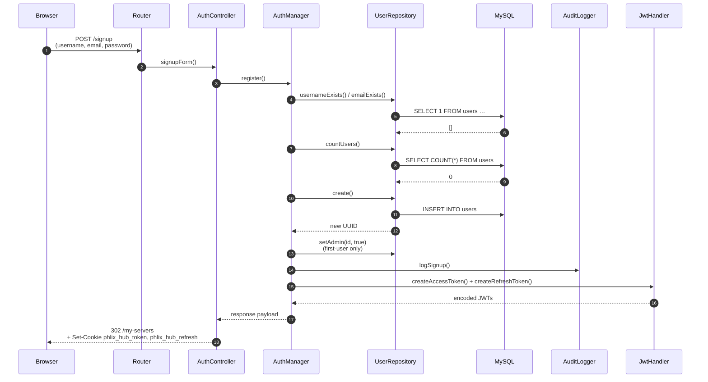
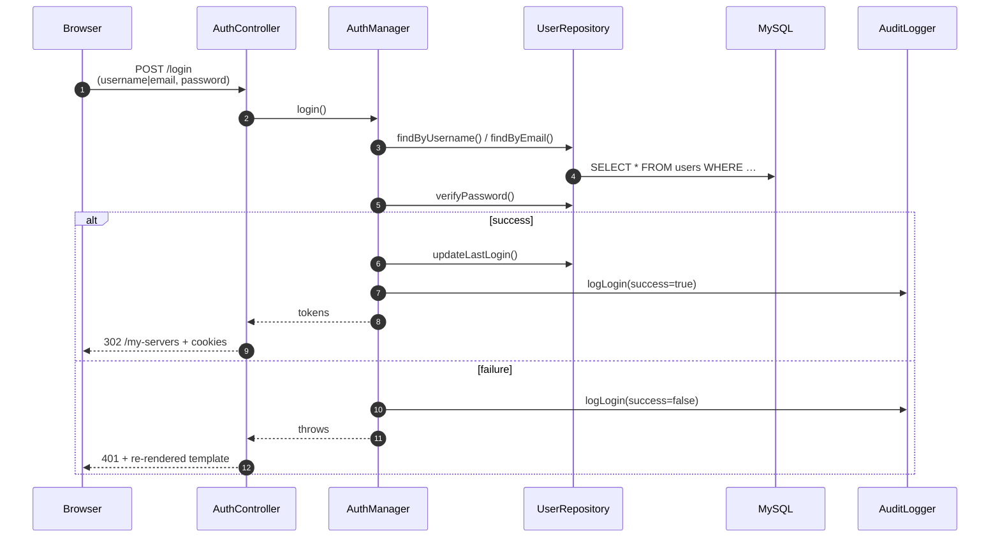
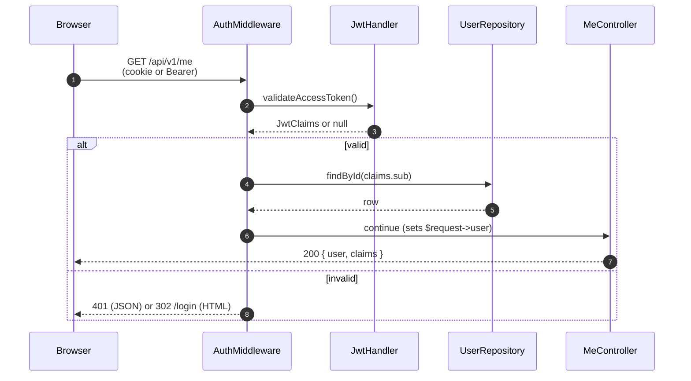

# Hub architecture

This document covers the runtime architecture of `phlix-hub` as of
**Step B.7** (signup / login / dashboard MVP). For the cross-repo
namespace split between `phlix-server`, `phlix-shared`, and `phlix-hub`,
see `plans/expansion/b.1-shared-design.md` in the `detain/phlix`
repo.

## Process model

`phlix-hub` boots a single Workerman HTTP worker bound to
`HUB_HOST`:`HUB_PORT` (default `0.0.0.0:8800`). The worker forks
`HUB_WORKERS` child processes (default 2). Every TCP message goes
through `Phlix\Hub\Application::boot()` which:

1. Wraps the incoming Workerman request in `Phlix\Hub\Http\Request`.
2. Dispatches to `Phlix\Hub\Http\Router::dispatch()`.
3. Runs each middleware in order; the first one to return a `Response`
   short-circuits the chain.
4. Invokes the matched controller and writes the returned
   `Phlix\Hub\Http\Response` back to the socket via
   `Response::toWorkermanResponse()`.

There is **no** session store and **no** per-connection state held in
memory — every authenticated request carries its own JWT.

## Container topology

The PSR-11 container is built by `ContainerFactory::create($appConfig)`
out of three service providers:

| Provider                | Registers                                                                                |
| ----------------------- | ---------------------------------------------------------------------------------------- |
| `CoreServicesProvider`  | `Connection`, `LoggerFactory`, one `logger.<channel>` alias per `LogChannels::*` constant. |
| `AuthServicesProvider`  | `JwtHandler`, `UserRepository`, `AuditLogger`, `AuthManager`.                           |
| `HttpServicesProvider`  | `PageRenderer`, `AuthController`, `PageController`, `MeController`, `AuthMiddleware`, `AdminMiddleware`. |

`PHLIX_HUB_CONTAINER_COMPILE=1` switches PHP-DI's compiled-container
cache on; off in dev.

## Auth flow

### 1. Signup



### 2. Login



### 3. Protected request



### 4. Logout

B.7 uses the **client-side cookie clear** strategy (plan §4 step 5,
option A). The hub does NOT track refresh-token revocation on the
server side. A logout simply clears the `phlix_hub_token` and
`phlix_hub_refresh` cookies, writes an audit log entry, and dispatches
`Phlix\Shared\Events\Auth\UserLoggedOut`.

Server-side refresh-token revocation (option B) is deferred to a Phase
L hardening task — it requires a `revoked_refresh_tokens` table and an
extra DB round-trip on every refresh. The MVP doesn't need it.

## JWT shape — the cross-repo wire

Every JWT the hub mints decodes into a
`Phlix\Shared\Auth\JwtClaims` instance via
`JwtClaims::fromPayload()`. This is the proof point for B.1's shared-
DTO design.

```php
$handler = $container->get(JwtHandler::class);
$token   = $handler->createAccessToken('user-uuid', ['library:read'], 'server-001');
$claims  = $handler->validateAccessToken($token);  // returns ?JwtClaims
echo $claims->iss;       // 'phlix-hub'
echo $claims->aud;       // 'hub'
echo $claims->sub;       // 'user-uuid'
echo $claims->type;      // 'access'
print_r($claims->scope); // ['library:read']
```

Hub-side tokens always carry:

| Claim     | Hub value         | Notes                                       |
| --------- | ----------------- | ------------------------------------------- |
| `iss`     | `phlix-hub`       | Distinguishes from server-minted (`phlix`). |
| `aud`     | `hub`             | The hub's own portal/API.                   |
| `sub`     | user UUID         | Subject.                                    |
| `iat`     | unix seconds      | Issued-at.                                  |
| `exp`     | unix seconds      | Issued-at + `HUB_JWT_ACCESS_TTL`.           |
| `type`    | `access`/`refresh`|                                             |
| `jti`     | (refresh only)    | 16-byte hex; future revocation support.     |
| `scope`   | list<string>      | Optional; empty array when unscoped.        |
| `serverId`| string\|null      | Reserved for Phase C client-→server tokens. |

The shared FQCN — `Phlix\Shared\Auth\JwtClaims` — lives in
`detain/phlix-shared` v0.2+ and is imported by both repos. When
`phlix-server` validates a hub-minted token (Phase C onward), it will
deserialize through the same `JwtClaims::fromPayload()` call.

## Admin bootstrap

The first user to register on a fresh install is auto-promoted to
admin via `UserRepository::setAdmin($id, true)` inside the same
transaction that creates the row. This matches the
`phlix-server` policy from SESSION_HANDOFF.md decision #7 and lets
the operator deploy + sign up + administer without an out-of-band
seeding step. A proper RBAC + invite flow lands in Phase D.

## CSRF

B.7 deliberately does not implement CSRF tokens. The protected routes
fall into two buckets:

1. **JSON APIs** (`/api/v1/*`) authenticate via the
   `Authorization: Bearer` header. Browsers do not auto-attach
   Authorization headers across origins, so the typical CSRF vector
   is closed.
2. **HTML pages** (`/my-servers`) authenticate via the
   `phlix_hub_token` cookie which is set with `SameSite=Lax`. The
   only mutating page route is `/logout` and the failure mode of a
   forged logout is "user has to log in again" — not worth a CSRF
   token for the MVP.

Re-evaluate when third-party hub integrations land in Phase L.

## Audit logging

Every signup, login (success + failure), and logout writes to the
`audit` log channel (`.logs/audit.log` by default). `AuditLogger`
methods are the canonical names for security telemetry on the hub:

```
audit:event=signup            user_id=… username=… email=…
audit:event=login    success=true   user_id=… device_id=…
audit:event=login    success=false  reason=bad_password …
audit:event=logout            user_id=… session_id=…
audit:event=permission_denied user_id=… resource=admin action=access
audit:event=auth_failure      reason=unknown_user identifier=…
```

---

## Pairing protocol internals

Step-by-step flow for pairing a `phlix-server` instance with the hub.

### Step 1 — Server initiates claim

```bash
# Server (HubClient) POSTs to hub:
POST https://hub.example.com/api/v1/server-claims/new
Content-Type: application/json
X-Phlix-Signature: Ed25519  (signature of request body using server's private key)

{
  "server_name": "Alice's NAS",
  "public_keys": [{ "kty": "OKP", "crv": "Ed25519", "x": "...", "kid": "..." }],
  "version": "1.2.0",
  "hostname_candidates": ["nas.alice.com", "192.168.1.100"]
}
```

### Step 2 — Hub generates claim code

- Hub stores `server_claims` row: `claim_code` (human-friendly `ABCD-1234`), `status=pending`, `expires_at=NOW+10min`
- Hub stores `servers` row: `status=claiming` (not yet linked to a user)
- Returns `201 Created`:

```json
{
  "claim_id": "uuid",
  "claim_code": "ABCD-1234",
  "expires_in": 600
}
```

### Step 3 — User redeems claim code

- User pastes `ABCD-1234` at `https://hub.example.com/claim`
- Hub looks up `server_claims` by `claim_code` where `status=pending` AND `expires_at > NOW`
- Hub issues **Ed25519 enrollment JWT** (7-day TTL, signed with hub's Ed25519 key):

```json
{
  "iss": "phlix-hub",
  "aud": "server",
  "sub": "server-uuid",
  "type": "enrollment",
  "exp": 1234567890
}
```

- Hub links `server_claims → servers` row, sets `status=paired`, `servers.status=online`, `servers.user_id=<claiming_user_id>`
- Hub responds:

```json
{
  "enrollment_jwt": "eyJ...",
  "hub_jwks_url": "https://hub.example.com/.well-known/jwks.json"
}
```

### Step 4 — Server stores enrollment and starts heartbeat

```bash
# Server saves to config/hub-enrollment.json:
{
  "enrollment_jwt": "eyJ...",
  "hub_jwks_url": "https://hub.example.com/.well-known/jwks.json",
  "server_id": "550e8400-...",
  "hub_base_url": "https://hub.example.com"
}

# Server starts 60s heartbeat loop:
POST https://hub.example.com/api/v1/servers/{server_id}/heartbeat
Authorization: Bearer {enrollment_jwt}

{
  "version": "1.2.0",
  "uptime_seconds": 86400,
  "active_sessions": 3,
  "active_transcodes": 1,
  "hostname_candidates": ["nas.alice.com", "192.168.1.100"]
}
```

### Step 5 — Hub issues user-session JWTs

- Hub validates the enrollment JWT (Ed25519, verifies against server's JWKS at `/.well-known/jwks.json`)
- Hub issues **RS256 user-session JWTs** that server-side `HubClient` uses to authenticate remote user requests through the hub relay:

```json
{
  "iss": "phlix-hub",
  "aud": "hub",
  "sub": "user-uuid",
  "serverId": "server-uuid",
  "scope": ["library:read", "library:playback"]
}
```

---

## Relay tunnel design

### Overview

The relay allows remote clients to access a server behind NAT — without opening inbound ports on the server.

1. Server connects **outbound** WebSocket to `wss://hub.example.com/relay/{server_id}` on startup (or on-demand when first remote client connects)
2. Server sends `RelaySession::TYPE_HELLO` carrying its Ed25519 enrollment JWT for authentication
3. Hub `TunnelManager` maps `server_id` → open `RelaySession`; authenticates server and opens a tunnel
4. When a remote client connects to `wss://hub.example.com/client/{server_id}`, the hub **multiplexes** the client connection over the existing server-side tunnel
5. `RelaySession` tracks: `worker_node` (which hub worker holds the WS), `bytes_in`, `bytes_out`, `opened_at`, `close_reason`
6. If the server WS drops, `TunnelManager` marks `closed_at` and notifies pending clients with `RelaySession::TYPE_DISCONNECTED`
7. Server re-connects automatically (HubClient retry loop with backoff); clients are notified and retry

```bash
# Server-side relay connect (outbound from server to hub):
wss://hub.example.com/relay/550e8400-e29b-41d4-a716-446655440000
Server → Hub: { "type": "hello", "enrollment_jwt": "eyJ...", "server_id": "..." }
Hub → Server: { "type": "hello_ack", "relay_session_id": "...", "tunnel_id": "..." }

# Client connect (inbound from client to hub, relayed to server):
wss://hub.example.com/client/550e8400-e29b-41d4-a716-446655440000
Hub → Server (over relay tunnel): { "type": "client_connect", "client_id": "...", "session_id": "..." }
```

---

## Namespace map

```
Phlix\Hub\          — Application bootstrap, Router, Config
Phlix\Hub\Auth\     — JwtHandler (RS256 for user sessions), UserRepository,
                      AuditLogger, AuthManager
Phlix\Hub\Relay\   — RelaySession (entity), TunnelManager (orchestrator)
Phlix\Hub\Webhooks\ — WebhookDispatcher, WebhookDelivery
Phlix\Hub\Http\    — Request, Response, Router, Controllers
                      (Auth, Server, User, Me, Health)
Phlix\Hub\Common\   — Container, Database (ConnectionPool),
                      Logger (LoggerFactory, LogChannels)
Phlix\Shared\       — Types shared with phlix-server:
                      JwtClaims, claim DTOs (ClaimRequest, ClaimResponse,
                      ServerInfoDto, HeartbeatDto),
                      events (Phlix\Shared\Events\*)
```

**Key split**: the hub repo never contains library scanning, transcoding, FFmpeg, HLS, DLNA, Live TV, or any `Phlix\Server\*` code. Those live exclusively in `phlix-server`.

---

## Debug recipes

### Enable debug logging

```bash
export HUB_LOG_LEVEL=debug
php public/index.php start
tail -f .logs/hub.log | grep -i "debug\|heartbeat\|relay\|claim"
```

In docker-compose:

```yaml
environment:
  - HUB_LOG_LEVEL=debug
```

### Connect to hub MySQL directly

```bash
mysql -h ${HUB_DB_HOST:-hub-db} -u phlix_hub -p phlix_hub
```

Useful queries:

```sql
-- Check pending claim codes (not yet redeemed):
SELECT id, claim_code, server_name, status, expires_at
FROM server_claims WHERE status = 'pending';

-- Check servers and last-seen:
SELECT id, server_name, status, last_seen_at FROM servers;

-- Check active relay sessions:
SELECT id, server_id, worker_node, bytes_in, bytes_out, opened_at
FROM relay_sessions WHERE closed_at IS NULL;

-- Check servers that have missed heartbeats (not seen in 2+ minutes):
SELECT id, server_name, last_seen_at
FROM servers WHERE last_seen_at < DATE_SUB(NOW(), INTERVAL 2 MINUTE);
```

### Heartbeat logs

```bash
# Watch heartbeat activity in real time:
tail -f .logs/hub.log | grep heartbeat

# Find all heartbeat events:
grep "heartbeat" .logs/hub.log

# Find heartbeat failures (non-2xx responses):
grep "heartbeat.*failed\|heartbeat.*error\|heartbeat.*401\|heartbeat.*403" .logs/hub.log

# Count heartbeats per server (for uptime reporting):
grep "heartbeat.*ok\|heartbeat.*200" .logs/hub.log | awk '{print $NF}' | sort | uniq -c
```

### Relay tunnel logs

```bash
# Watch relay tunnel activity:
tail -f .logs/hub.log | grep relay

# Find tunnel open events:
grep "relay.*hello\|relay.*hello_ack\|relay.*open" .logs/hub.log

# Find tunnel close/drop events:
grep "relay.*close\|relay.*disconnect\|relay.*dropped\|relay.*error" .logs/hub.log

# Watch bytes_in/bytes_out on relay sessions:
grep "relay.*bytes" .logs/hub.log

# Filter by specific server:
grep "550e8400-e29b-41d4-a716-446655440000" .logs/hub.log | grep relay
```

---

## What can go wrong

### Failure 1: Claim code expired

**Symptom:** Server pairing stalls after displaying the claim code. User pastes the code at `https://hub.example.com/claim` but gets "Invalid or expired claim code."

**Diagnosis:**
```bash
# Server-side HubClient logs for claim initiation:
grep "claim\|pairing" .logs/phlix.log | tail -20

# On the hub, check claim code status:
mysql -h hub-db -u phlix_hub -p phlix_hub \
  -e "SELECT claim_code, status, expires_at, created_at
      FROM server_claims
      WHERE claim_code = 'ABCD-1234';"

# Hub logs for claim initiation:
grep "claim\|server-claims" .logs/hub.log | tail -20
```

**Fix:** Re-initiate pairing. On the server: `php scripts/pair-with-hub.php https://hub.example.com "Server Name"` and complete the redemption within 10 minutes.

---

### Failure 2: Server heartbeat missed (3 consecutive)

**Symptom:** Hub marks the server as `offline`. Remote relay connections to that server fail.

**Diagnosis:**
```bash
# On the hub, check the server's last_seen_at:
mysql -h hub-db -u phlix_hub -p phlix_hub \
  -e "SELECT server_name, status, last_seen_at
      FROM servers WHERE server_name = 'Alice NAS';"

# On the server, check the heartbeat loop logs:
grep "heartbeat" .logs/phlix.log | tail -50

# Check if the enrollment JWT has expired (7-day TTL):
cat config/hub-enrollment.json | grep enrolled_at
```

**Fix:** Restart the heartbeat loop: `php scripts/pair-with-hub.php` (re-initiates pairing if enrollment JWT is expired, otherwise just restarts heartbeat). For persistent network issues, increase `PHLIX_HEARTBEAT_INTERVAL`.

---

### Failure 3: Relay tunnel dropped

**Symptom:** Remote client connects to the hub and authenticates, but the stream stalls or the WebSocket closes. Hub dashboard shows the server as `online` but no relay session is active.

**Diagnosis:**
```bash
# On the hub, check relay session status:
mysql -h hub-db -u phlix_hub -p phlix_hub \
  -e "SELECT id, server_id, worker_node, bytes_in, bytes_out,
             opened_at, closed_at, close_reason
      FROM relay_sessions
      WHERE server_id = '550e8400-...'
      ORDER BY opened_at DESC LIMIT 5;"

# Check hub relay logs for tunnel open/close events:
grep "relay.*hello\|relay.*close\|relay.*drop\|relay.*error" .logs/hub.log | tail -30

# On the server, check the outbound WS connection to the hub:
grep -i "relay\|wss\|hub.*connect" .logs/phlix.log | tail -20

# Check if outbound port 8800 is blocked (NAT/firewall):
ss -tnp | grep ":8800"
```

**Fix:** The HubClient reconnect loop re-establishes the outbound WebSocket automatically within seconds. If tunnels drop repeatedly: (1) check NAT timeout (reduce `PHLIX_HEARTBEAT_INTERVAL` or add server-side keepalive), (2) hub worker restart drops all relay sessions — servers reconnect automatically, (3) firewall/proxy dropping idle connections. For production, consider a layer-4 load balancer that preserves TCP connections.

---

## Container image

`Dockerfile` at the repo root builds a single-stage `php:8.3-fpm-alpine`
image with swoole, php-uv, nginx, and supervisor.

### Layer ordering

Composer install is split in two layers so the vendor tree survives
source-only edits:

```dockerfile
COPY composer.json composer.lock /var/www/html/
RUN composer install --no-dev --prefer-dist --no-scripts --no-autoloader \
                     --ignore-platform-reqs
COPY . /var/www/html/
RUN composer dump-autoload --no-dev --optimize
```

Practical result: editing `src/` does not rebuild the swoole compile
layer (the slowest one). Editing `composer.{json,lock}` does.

### Swoole `./configure` flags

The image compiles swoole from source. The intentional flag set is:

```
--enable-swoole --enable-sockets --enable-mysqlnd
--enable-swoole-curl --enable-cares
--enable-swoole-pgsql --enable-swoole-sqlite
--with-openssl-dir=/usr --with-nghttp2-dir=/usr
--enable-swoole-coro-time --enable-zstd --enable-brotli
--enable-iouring --enable-uring-socket
--with-swoole-ssh2 --enable-swoole-ftp
```

Each flag requires the matching `-dev` package added to `apk add`
(e.g. `--enable-iouring` ↔ `liburing-dev`, `--with-swoole-ssh2` ↔
`libssh2-dev`, `--enable-swoole-pgsql` ↔ `postgresql-dev`).

**io_uring** requires **Linux kernel 5.6+ at runtime**. Older kernels
silently fall back to epoll — the image still builds and runs, but
the io_uring fast path is unused.

**Deliberately omitted:** `--enable-swoole-thread`,
`--enable-thread-context` (require ZTS PHP; upstream
`php:8.3-fpm-alpine` is NTS — mixing crashes at module init), and
`--enable-swoole-stdext` (experimental upstream; replaces stdlib
functions with coroutine versions and breaks third-party extensions).

### Alpine quirks

`phpenmod` ships with Debian's PHP packages — **it does not exist on
Alpine**. The image wires extensions via `docker-php-ext-install` and
hand-written `.ini` files under `/usr/local/etc/php/conf.d/`. Any
script that shells out to `phpenmod` will fail with
`command not found` on this image.

### CI build cache

`docker.yml` (in `phlix-server`, which builds this image cross-repo)
uses both GHA cache and the registry image as cache sources, with
`mode=max` so every intermediate layer — including the slow swoole/uv
compile layers — is exported and reusable across PR builds.

## Next steps

- [`docs/dev/schema.md`](schema.md) — complete hub DB schema with ER diagram, table columns, indexes, and FK relationships
- [`detain/phlix/docs/dev/pairing-protocol.md`](https://github.com/detain/phlix/blob/master/docs/dev/pairing-protocol.md) — full protocol specification with sequence diagrams
- [`detain/phlix/docs/dev/relay-protocol.md`](https://github.com/detain/phlix/blob/master/docs/dev/relay-protocol.md) — deep dive on tunnel establishment, message framing, and reconnection logic
- [`detain/phlix/docs/dev/architecture-server.md`](https://github.com/detain/phlix/blob/master/docs/dev/architecture-server.md) — server-side architecture (library scanning, transcoding, streaming, DLNA, Live TV)
- [`detain/phlix-shared`](https://github.com/detain/phlix-shared) — shared DTOs, JWT claims, and events used by both repos
