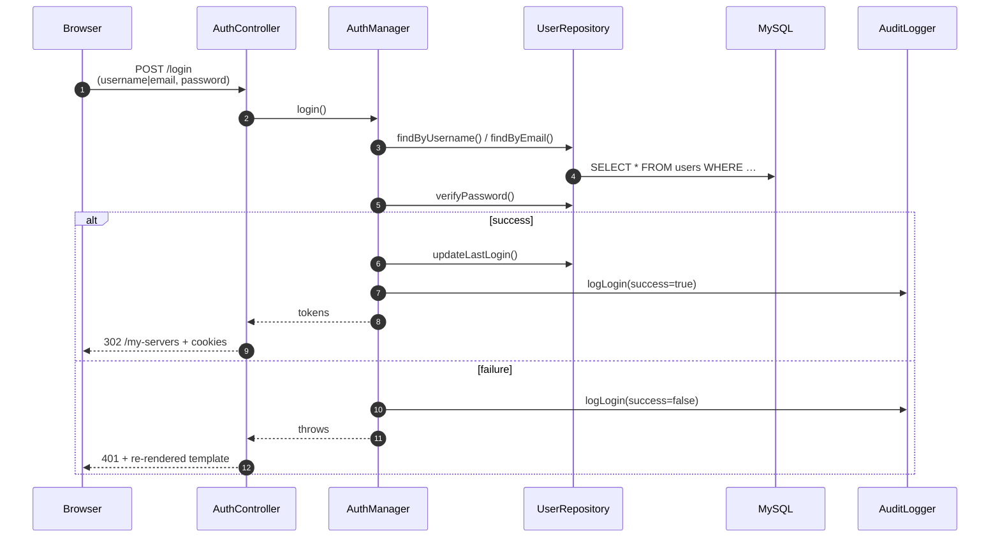
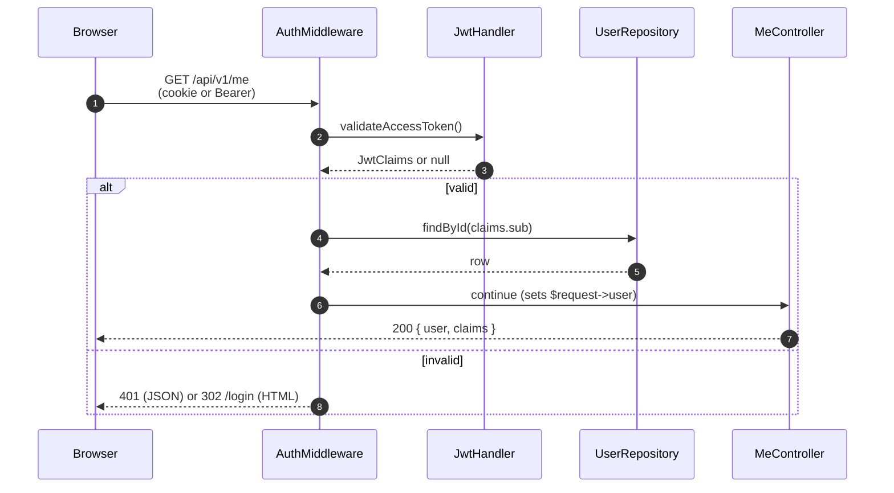

# Hub architecture

This document covers the runtime architecture of `phlex-hub` as of
**Step B.7** (signup / login / dashboard MVP). For the cross-repo
namespace split between `phlex-server`, `phlex-shared`, and `phlex-hub`,
see `plans/expansion/b.1-shared-design.md` in the `detain/phlex`
repo.

## Process model

`phlex-hub` boots a single Workerman HTTP worker bound to
`HUB_HOST`:`HUB_PORT` (default `0.0.0.0:8800`). The worker forks
`HUB_WORKERS` child processes (default 2). Every TCP message goes
through `Phlex\Hub\Application::boot()` which:

1. Wraps the incoming Workerman request in `Phlex\Hub\Http\Request`.
2. Dispatches to `Phlex\Hub\Http\Router::dispatch()`.
3. Runs each middleware in order; the first one to return a `Response`
   short-circuits the chain.
4. Invokes the matched controller and writes the returned
   `Phlex\Hub\Http\Response` back to the socket via
   `Response::toWorkermanResponse()`.

There is **no** session store and **no** per-connection state held in
memory — every authenticated request carries its own JWT.

## Container topology

The PSR-11 container is built by `ContainerFactory::create($appConfig)`
out of three service providers:

| Provider                | Registers                                                                                |
| ----------------------- | ---------------------------------------------------------------------------------------- |
| `CoreServicesProvider`  | `Connection`, `LoggerFactory`, one `logger.<channel>` alias per `LogChannels::*` constant. |
| `AuthServicesProvider`  | `JwtHandler`, `UserRepository`, `AuditLogger`, `AuthManager`.                           |
| `HttpServicesProvider`  | `PageRenderer`, `AuthController`, `PageController`, `MeController`, `AuthMiddleware`, `AdminMiddleware`. |

`PHLEX_HUB_CONTAINER_COMPILE=1` switches PHP-DI's compiled-container
cache on; off in dev.

## Auth flow

### 1. Signup


### 2. Login



### 3. Protected request



### 4. Logout

B.7 uses the **client-side cookie clear** strategy (plan §4 step 5,
option A). The hub does NOT track refresh-token revocation on the
server side. A logout simply clears the `phlex_hub_token` and
`phlex_hub_refresh` cookies, writes an audit log entry, and dispatches
`Phlex\Shared\Events\Auth\UserLoggedOut`.

Server-side refresh-token revocation (option B) is deferred to a Phase
L hardening task — it requires a `revoked_refresh_tokens` table and an
extra DB round-trip on every refresh. The MVP doesn't need it.

## JWT shape — the cross-repo wire

Every JWT the hub mints decodes into a
`Phlex\Shared\Auth\JwtClaims` instance via
`JwtClaims::fromPayload()`. This is the proof point for B.1's shared-
DTO design.

```php
$handler = $container->get(JwtHandler::class);
$token   = $handler->createAccessToken('user-uuid', ['library:read'], 'server-001');
$claims  = $handler->validateAccessToken($token);  // returns ?JwtClaims
echo $claims->iss;       // 'phlex-hub'
echo $claims->aud;       // 'hub'
echo $claims->sub;       // 'user-uuid'
echo $claims->type;      // 'access'
print_r($claims->scope); // ['library:read']
```

Hub-side tokens always carry:

| Claim     | Hub value         | Notes                                       |
| --------- | ----------------- | ------------------------------------------- |
| `iss`     | `phlex-hub`       | Distinguishes from server-minted (`phlex`). |
| `aud`     | `hub`             | The hub's own portal/API.                   |
| `sub`     | user UUID         | Subject.                                    |
| `iat`     | unix seconds      | Issued-at.                                  |
| `exp`     | unix seconds      | Issued-at + `HUB_JWT_ACCESS_TTL`.           |
| `type`    | `access`/`refresh`|                                             |
| `jti`     | (refresh only)    | 16-byte hex; future revocation support.     |
| `scope`   | list<string>      | Optional; empty array when unscoped.        |
| `serverId`| string\|null      | Reserved for Phase C client-→server tokens. |

The shared FQCN — `Phlex\Shared\Auth\JwtClaims` — lives in
`detain/phlex-shared` v0.2+ and is imported by both repos. When
`phlex-server` validates a hub-minted token (Phase C onward), it will
deserialize through the same `JwtClaims::fromPayload()` call.

## Admin bootstrap

The first user to register on a fresh install is auto-promoted to
admin via `UserRepository::setAdmin($id, true)` inside the same
transaction that creates the row. This matches the
`phlex-server` policy from SESSION_HANDOFF.md decision #7 and lets
the operator deploy + sign up + administer without an out-of-band
seeding step. A proper RBAC + invite flow lands in Phase D.

## CSRF

B.7 deliberately does not implement CSRF tokens. The protected routes
fall into two buckets:

1. **JSON APIs** (`/api/v1/*`) authenticate via the
   `Authorization: Bearer` header. Browsers do not auto-attach
   Authorization headers across origins, so the typical CSRF vector
   is closed.
2. **HTML pages** (`/my-servers`) authenticate via the
   `phlex_hub_token` cookie which is set with `SameSite=Lax`. The
   only mutating page route is `/logout` and the failure mode of a
   forged logout is "user has to log in again" — not worth a CSRF
   token for the MVP.

Re-evaluate when third-party hub integrations land in Phase L.

## Audit logging

Every signup, login (success + failure), and logout writes to the
`audit` log channel (`.logs/audit.log` by default). `AuditLogger`
methods are the canonical names for security telemetry on the hub:

```
audit:event=signup            user_id=… username=… email=…
audit:event=login    success=true   user_id=… device_id=…
audit:event=login    success=false  reason=bad_password …
audit:event=logout            user_id=… session_id=…
audit:event=permission_denied user_id=… resource=admin action=access
audit:event=auth_failure      reason=unknown_user identifier=…
```
